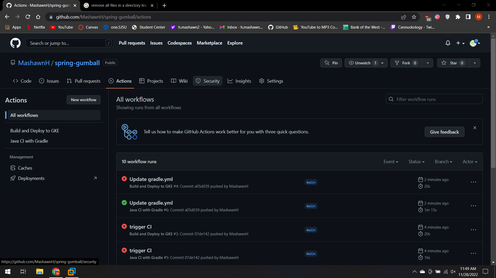
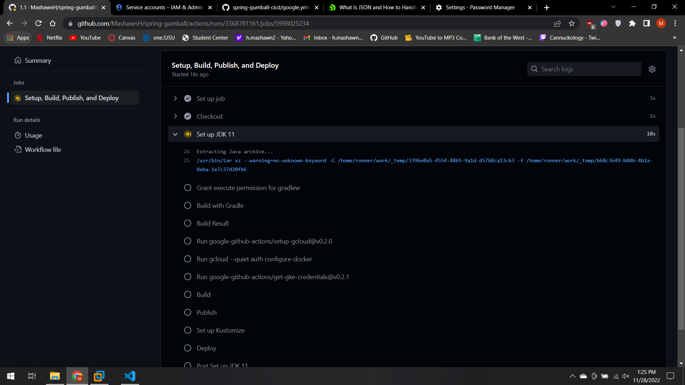
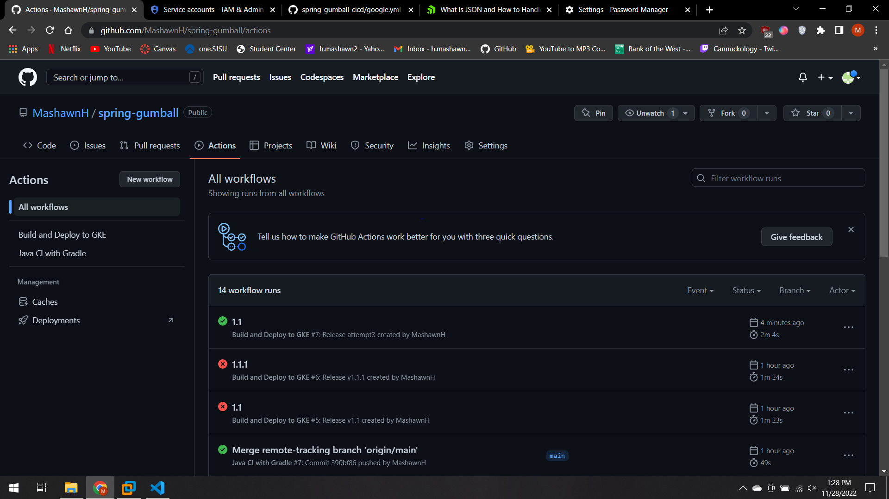
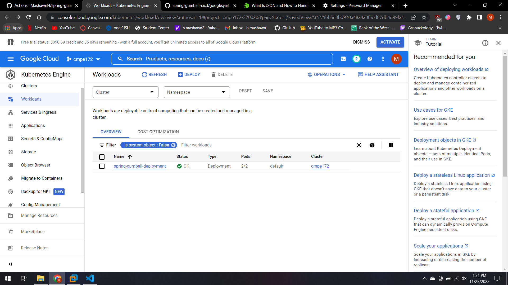
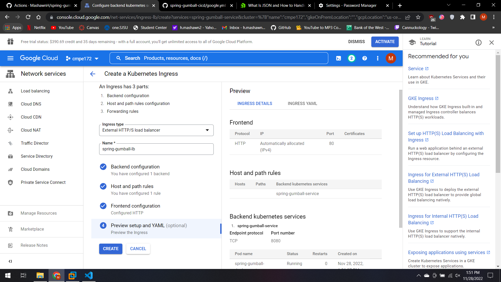
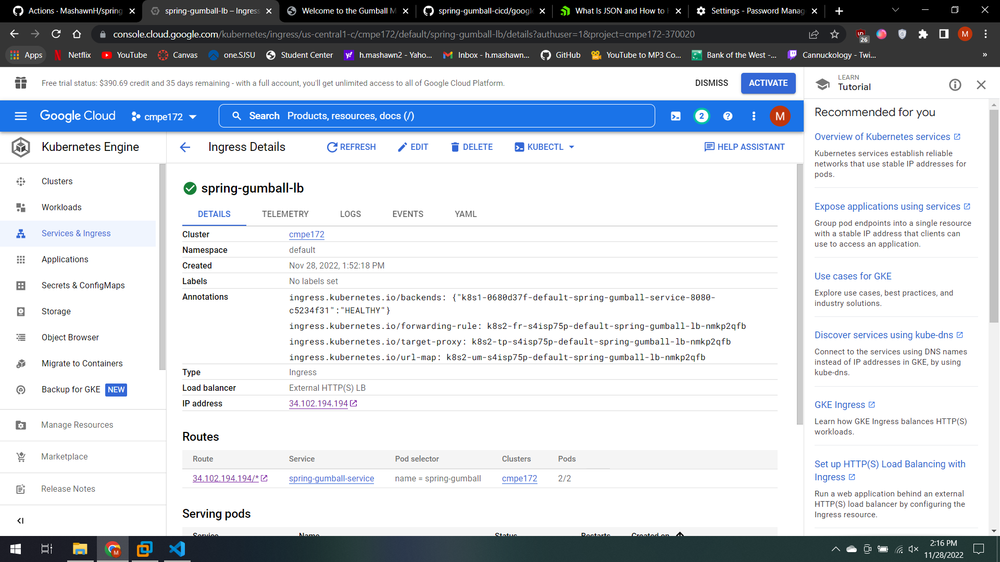
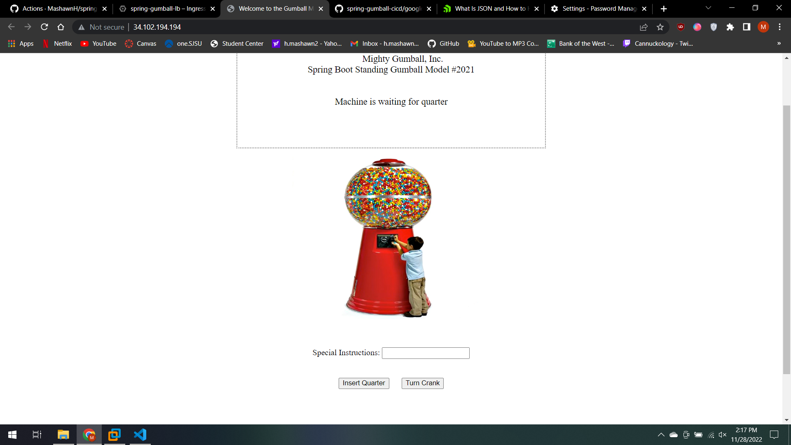

# spring-gumball ci/cd example

Triggering Gradle build via CI successfully

Triggering GKE deployment via CD 

CD Success

Deployment of 2 pods on GKE

Setting up ingress

Successfully creating load balancer

Gumball site working

